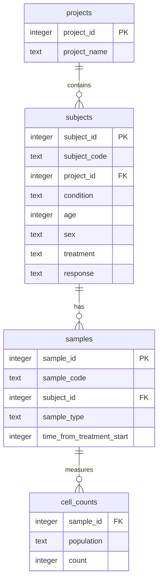
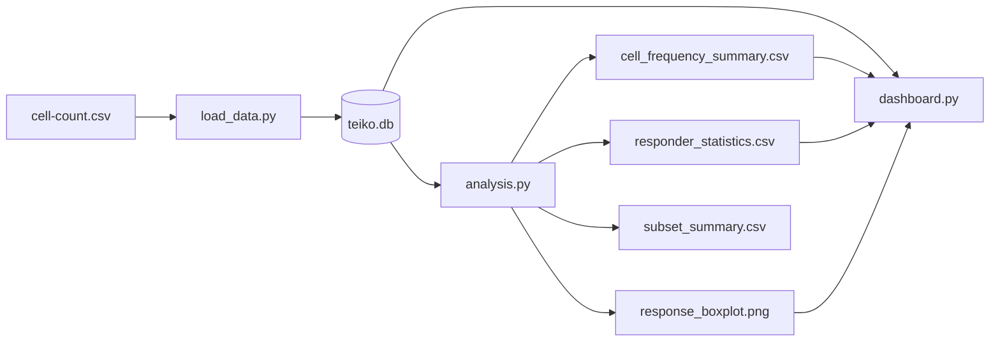

# Teiko Technical Analysis

This repository contains a straightforward Python solution for the Teiko cell-count assignment. It loads `cell-count.csv` into SQLite, generates the requested summary tables and statistical outputs, and starts a small interactive Streamlit dashboard.

## Run

```bash
make setup
make pipeline
make dashboard
```

`make pipeline` creates `teiko.db` and writes analysis outputs into `outputs/`.

## Outputs

- `outputs/cell_frequency_summary.csv`: one row per sample and cell population with total count, raw count, and relative frequency percentage.
- `outputs/responder_statistics.csv`: Welch two-sample t-test results comparing melanoma PBMC miraclib responders and non-responders.
- `outputs/response_boxplot.png`: boxplot of relative frequencies by response group.
- `outputs/baseline_melanoma_miraclib_pbmc_samples.csv`: baseline melanoma PBMC samples from subjects treated with miraclib.
- `outputs/subset_summary.csv`: requested project, response, sex, and B-cell subset summaries.

The loaded database contains 3 projects, 3,500 subjects, 10,500 samples, and 52,500 cell-count records.

## Database Schema

The SQLite database uses four tables:

- `projects`: one row per project.
- `subjects`: one row per subject, linked to a project. Subject-level metadata such as condition, age, sex, treatment, and response live here.
- `samples`: one row per biological sample, linked to a subject. Sample type and treatment time live here.
- `cell_counts`: one row per sample and immune cell population.

This design avoids repeating project and subject metadata for every population count. It also keeps immune cell populations in rows rather than hard-coded columns, which makes frequency summaries, group comparisons, and future population additions easier. If this scaled to hundreds of projects and thousands of samples, the same schema would support indexed filtering by project, condition, treatment, response, sample type, time point, and population without changing the analytical queries.



## Pipeline Flow



The first diagram explains the database relationships. The second diagram explains how the project runs: the CSV is loaded into SQLite, the analysis script generates reproducible outputs, and the dashboard reads the database to show the results interactively.

## Code Structure

- `load_data.py` creates the schema and loads the CSV into SQLite. It is intentionally executable with `python load_data.py` and requires no arguments.
- `analysis.py` reads from SQLite, computes relative frequencies, performs responder statistics, writes output files, and saves the boxplot.
- `dashboard.py` reads from SQLite and exposes an interactive dashboard for filtering data, reviewing the frequency table, comparing responder groups, viewing the statistics table, and inspecting baseline subset summaries.
- `Makefile` provides the exact `setup`, `pipeline`, and `dashboard` targets requested by the assignment.

## Statistical Decision

For each immune population, the program compares relative frequency percentages between melanoma PBMC miraclib responders and non-responders using Welch's two-sample t-test. Welch's test was chosen because it does not assume the two response groups have equal variance. Results are marked significant when `p_value < 0.05`.

In the generated output, `cd4_t_cell` is the only population marked significant at the 0.05 level. Its responder mean frequency is higher by 0.64 percentage points, with `p_value = 0.005013`.

## Subset Findings

For baseline melanoma PBMC samples from miraclib-treated subjects:

- Project counts: `prj1 = 384`, `prj3 = 272`.
- Responder subjects: `yes = 331`, `no = 325`.
- Sex counts: `M = 344`, `F = 312`.
- Average B-cell count for melanoma male responders at time 0, using all sample and treatment types: `10206.15`.

## Dashboard Link

Run `make dashboard` locally. Streamlit will print a local URL, typically:

http://localhost:8501

The dashboard is intentionally local because the assignment says the grader will run the project in GitHub Codespaces. In Codespaces, the same command starts Streamlit and exposes the forwarded port URL.
